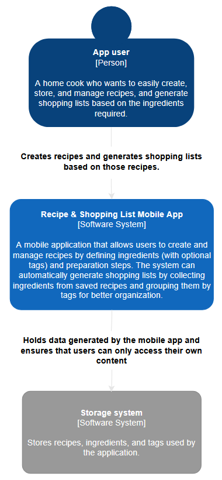
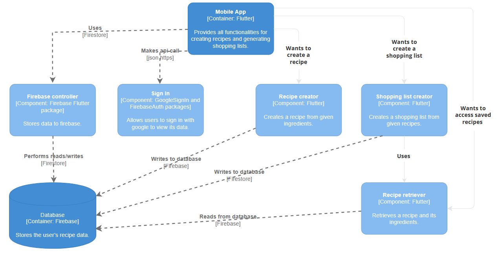
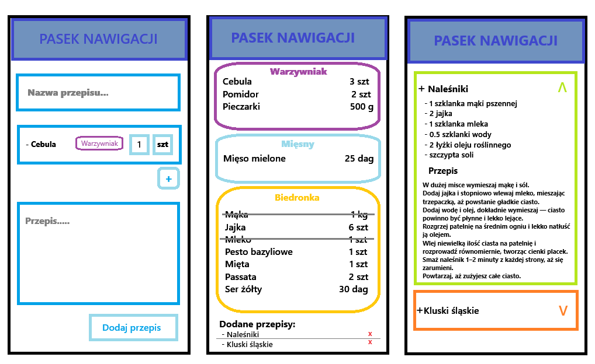

# Recipe & Shopping list Mobile App

A mobile app for saving, viewing recipes and creating a shopping list based on them, developed as part of a university course 'Programowanie interfejsów mobilnych' (Mobile interface programming).

## Technology stack
- Flutter (Dart)
- Firebase (Google authentication, Firestore)

## Features
The application contains 3 views which can be changed via **bottom navigation bar**:
1. **Recipes list**
    - View saved recipes from Firestore for the logged-in user.
    - Expand/collapse a recipe to see/hide ingredients and instructions.
    - Delete a recipe (with confirmation dialog).
    - Add recipe to shopping list (only when edit mode is enabled).
2. **Add new recipe**
    - Provide recipe name, ingredients (name, amount, unit, optional tag), and instructions.
    - Guests cannot add recipes (snackbar message displayed).
    - Form validation with error snackbar.
    - Ingredient name and tag use autocomplete from saved recipes.
    - The unit field is a dropdown list, allowing the user to select from predefined units.
3. **Shopping list**
    - Edit mode: remove or change ingredient quantities.
    - Non-edit mode: view-only, check purchased items.
    - Turning on edit mode unchecks all ingredients (with confirmation dialog).
    - Ingredients with the same tag, name, and unit are grouped and summed.
    
Additionally there is a **drawer** which contains user's information, a login/logout button and a toggle to change the theme of the app (system one is the default).

### Firestore
Firestore is used to save users' recipes. Database structure: `/{user_uid}/{recipe_name}`. Every recipe contains:
```
directions: string
ingredients: Array<object>
    [
        {
            name: string,
            amount: number,
            unit: string,
            tag: string?
        },
        {
            name: string,
            amount: number,
            unit: string,
            tag: string?
        }
    ]
```

### SharedPreferences
Data stored locally:
- `'themeMode'`
- `'is_edit_mode_${user_uid}'`
- `'cart_data_${user_uid}'`
- `'checked_ingredients_${user_uid}'`

## Handled critical situations
- Deleting a recipe removes it from the cart.
- Cannot add a recipe to the cart if edit mode is disabled.
- Adding an already existing recipe in the cart increments the quantity.


## Diagrams

### C1


### C3



## Mockups

